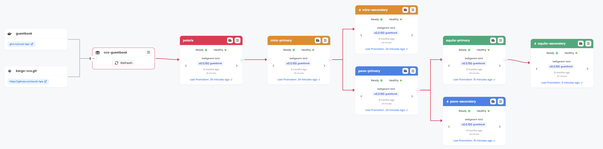

# Kargo Advanced Example
.
This is a GitOps repository of an Kargo example that showcases advanced Kargo
techniques and features. This example will create multiple Argo CD Applications
and Kargo Stages with a pipeline to progress both Git and image changes through
multiple Stages.

## Features

* A Warehouse which monitors both a container repository for new images and manifest changes in Git
* Stage deploy pipeline with A/B testing
* Promotion of Git changes and image tags
* Verification with analysis of an HTTP REST endpoint
* Argo CD Application syncing
* Control flow Stage to coordinate promotion to multiple Stages
* Rendered branches

## Requirements

* Kargo v1.2.x (for older Kargo versions, switch to the release-X.Y branch)
* An Argo CD instance
* GitHub and a container registry (GHCR.io)
* `git` and `docker` installed

## Instructions

1. Stand up a KIND cluster with the `kargo-quickstart-kind.sh`

   ```shell
   ./kargo-quickstart-kind.sh
   ```
   
2. Create a guestbook container image repository in your GitHub account. 

   The easiest way to create a new ghcr.io image repository, is by retagging and
   pushing an existing image with your GitHub username:

   ```shell
   docker buildx imagetools create \
     ghcr.io/akuity/guestbook:latest \
     -t ghcr.io/<yourgithubusername>/guestbook:v0.0.1
   ```

   You will now have a `guestbook` container image repository. e.g.:
   https://github.com/yourgithubusername/guestbook/pkgs/container/guestbook

3. Change guestbook container image repository to public.

   In the GitHub UI, navigate to the "guestbook" container repository, Package 
   settings, and change the visibility of the package to public. This will allow
   Kargo to monitor this repository for new images, without requiring you to
   configuring Kargo with container image repository credentials.

   


4. Login to Kargo and Argo CD:

   ```shell
   kargo login http://localhost:31081 --admin 
   argocd login --username admin --insecure localhost:31080
   ```

5. Create the Argo CD `guestbook` Project and Applications

   ```shell
   argocd project create -f ./argocd/appproj.yaml
   argocd appset create ./argocd/appset.yaml
   ```

6. Create the Kargo resources

   ```shell
   kargo apply -f ./kargo
   ```

7. Add git repository credentials to Kargo (replace `<yourgithubusername>`
    with your username). Token scopes are `delete:packages`, `repo`, `write:packages`.

    ```shell
    kargo create repo-credentials github-creds \
      --project=kargo-ccs \
      --git \
      --username <yourgithubusername> \
      --repo-url=https://github.com/<yourgithubusername>/kargo-ccs.git
    ```

    As part of the promotion process, Kargo requires privileges to commit changes
    to your Git repository. Ensure that the given token has these privileges.

8. Vist the Kargo and ArgoCD Dashboards
   
   ```
   kargo: http://localhost:31081
   argocd: http://localhost:31080
   ```
   
8. Promote the image!

    You now have a Kargo Pipeline which promotes images from the guestbook
    container image repository, through a multi-stage deploy pipeline.
    Visit the`kargo-advanced` Project in the Kargo UI to see the deploy pipeline.

    

    To promote, click the target icon to the left of the `dev` Stage, select the
    detected Freight, and click `Yes` to promote. Once promoted, the freight will
    be qualified to be promoted to downstream Stages (`staging`, `prod`).

## Simulating a release

To simulate a release, simply retag an image with a newer semantic version. e.g.:

```shell
docker buildx imagetools create \
  ghcr.io/akuity/guestbook:latest \
  -t ghcr.io/<yourgithubusername>/guestbook:v0.0.2
```

Then refresh the Warehouse in the UI to detect the new Freight.

## Promoting Manifest Changes

To promote a manifest change, edit the contents under the [`base`](./base)
directory. For example, you modify `guestbook-deploy.yaml` with an additional
environment variable:

```yaml
        env:
        - name: FOO
          value: bar
```

Kargo will promote the environment variable in the same manner as with image tags.

